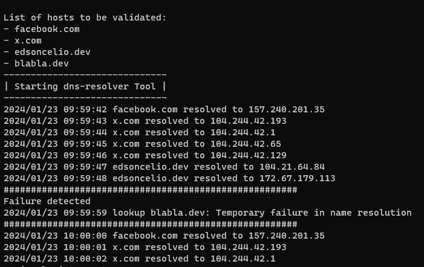

[](https://github.com/cassioliveiram/go-dns-resolver/actions/workflows/gh-actions.yaml)

## go-dns-resolver

The go DNS Resolver is a tool to validate like nslookup a list of dns servers and get back the correspondent
ips.



### Running the Aplication

1. Go to dns-lookup folder
2. Update the hosts.txt in hostfiles folder
3. run the application
   ````bash
   go run main.go
   ````

### Roadmap

For the future this toll will evolve to be a K8s deployment to help you to validate possible dns issues/performance.